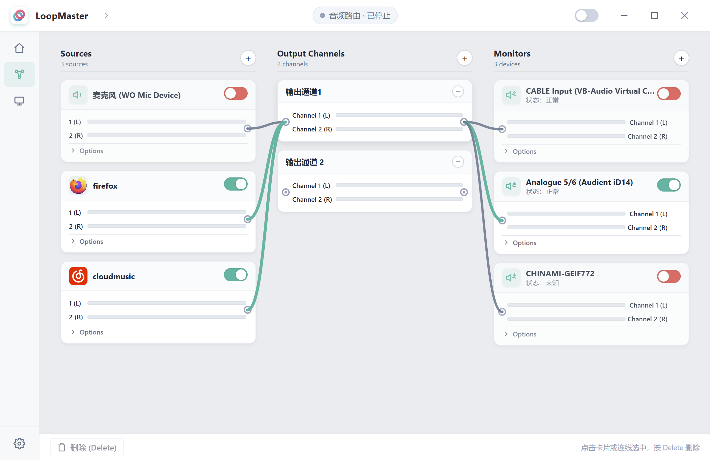

<div align="center">
  
  <h1>LoopMaster 音频路由</h1>
  <p>Windows 桌面端音频路由与回环监听工具</p>
  <p>
    
    
    
    
    
    <a href="LICENSE"></a>
  </p>
</div>

LoopMaster 是一个 Windows 桌面应用，核心能力是**把任意软件进程的音频自由路由到任意输出**：以 Loopback 风格的三列可视化画布，把「音频来源（含指定程序的播放声）→ 输出通道 → 外部输出/监听」灵活连线，并实时显示每条连线的 L/R 电平。

## 软件简介

在 Windows 上，把某个应用的声音、麦克风或声卡输入「引到」另一个输出设备（扬声器、耳机、虚拟声卡、录音软件）并不是一件开箱即用的小事。系统自带的音量混合器只能调节音量，无法自由地把一条音源接到另一条输出链路；而专业 DAW 又过于庞杂。LoopMaster 的出发点就是：**用一张看得懂的画布，把音频「从哪里来、经过什么、到哪里去」连起来**。

- **它解决什么**：把任意音频来源路由到任意输出，尤其是**按进程路由**——可以单独捕获某一个软件的播放声（例如浏览器、游戏、音乐播放器、会议软件），而不影响系统其他声音；再把它送到扬声器、耳机、虚拟声卡（如 VB-CABLE）或录音/会议软件可拾取的输入，并在中间做回环监听。
- **它怎么工作**：底层通过 Windows WASAPI 进行音频捕获与渲染，用 Rust 实时音频引擎维护一张路由图；前端只负责把这张图画出来、把你的操作翻译成命令，并订阅引擎推送的电平与状态。所有处理都在本机完成，没有云端、不上传任何音频。
- **它不做什么**：LoopMaster 不是虚拟声卡驱动，也不创建系统级音频设备；它做的是在「已存在的设备」之间做灵活路由与回环。

## 核心功能

- **按进程路由软件声音**：可把某一个软件的播放声作为独立音频来源单独捕获——例如只取浏览器的网页音频、或只取游戏的声音，而系统其他程序、通知声不受影响。来源既能是某个进程/应用的输出，也能是麦克风或声卡物理输入，统一在三列画布里管理。
- **自由路由**：来源、输出通道、外部输出之间可任意连线，一条来源能扇出到多个目的地，一个目的地也能汇合多条来源；路由关系完全由你在画布上决定，不受系统混音器固定链路的限制。
- **send 通道映射**：可以为每条 send 配置通道映射（`set_send_channel_map`），把来源的某个声道映射到输出的指定声道，满足单声道/双声道、左右互换等场景。注意：部分映射变更需要重启引擎后生效。
- **节点增益与静音**：每个节点支持增益（音量）与静音控制，便于在路由层面平衡各路音量，而无需改动系统混音器。

## 界面预览

| 路由工作区 |
| --- |
|  |


## 音频支持

LoopMaster 在 Windows 上通过 WASAPI 处理音频，目前面向常见的消费级设备与回环场景。

| 能力 | 状态 | 说明 |
| --- | --- | --- |
| 音频来源捕获 | 已支持 | 通过 WASAPI 捕获系统、指定进程/应用的播放声、麦克风或物理输入 |
| 输出通道渲染 | 已支持 | 渲染到系统输出或监听设备 |
| 逐通道 L/R 电平 | 已支持 | 每条 send 独立显示左右声道峰值 |
| 增益 / 静音 | 已支持 | 节点级增益与静音控制 |
| 拓扑热编辑 | 部分支持 | 部分拓扑变化需重启引擎后生效 |
| 采样率/位深适配 | 扩展方向 | 44.1/48 kHz、16-bit PCM 等门禁验证中 |

当前不承诺完整兼容所有厂商音频驱动、虚拟声卡私有实现或专业 ASIO 设备。

## 技术栈

| 层级 | 技术 |
| --- | --- |
| 桌面前端 | Tauri 2.11、React 19、TypeScript、Vite |
| 应用服务 | Rust 2021（`app-service`，业务服务边界） |
| 音频核心 | Rust 2021（`audio-core`，路由图、FIFO、rubato 重采样） |
| 音频后端 | Rust 2021（`audio-windows`，WASAPI 捕获/渲染、设备重连） |
| 诊断工具 | Rust 2021（`diagnostics`） |
| 构建与打包 | Cargo、npm、NSIS、WiX |

React 负责界面、交互与状态展示，通过 Tauri command/event 与 `app-service` 通信；**前端不直接接触 WASAPI、音频 FIFO 或实时线程**。

## 使用方式

1. 从源码构建安装包（见下文），或运行开发版。
2. 启动应用后点击「启动引擎」；首次启动需至少添加一个音频来源和一个输出目标。
3. 在三列画布中拖拽连线建立路由，使用开关、增益/静音控制节点。
4. 观察每条连线的 L/R 电平表，确认路由按预期工作。
5. 部分拓扑变化（如重命名、通道映射）需要重启引擎后生效。

音频设备可见性与稳定性受 Windows 版本、厂商驱动、设备拔插与独占模式影响。

## 从源码构建

当前构建在 Windows 环境验证。需要准备：

- Windows 10 / 11（x64）；
- Rust stable 工具链（建议 [rustup](https://rustup.rs/)）；
- Node.js 18+（含 npm）；
- C++ 生成工具（Windows SDK），Rust 与 Tauri 编译所需；
- WebView2 运行时（安装包默认在线引导安装，需联网）。

### 开发模式

```powershell
cd frontend
npm install
npm run tauri dev      # 编译 Rust + 热重载前端，打开开发窗口
```

### 构建安装包

安装包统一输出到仓库根目录的 `dist-installer/`（该目录已在 `.gitignore` 中被忽略）。

```powershell
cd frontend
npm run build:installer
```

产物：

```text
dist-installer/
├── LoopMaster_1.0.0_x64-setup.exe   # NSIS 安装程序（推荐分发）
└── LoopMaster_1.0.0_x64_zh-CN.msi   # MSI 安装包
```

仅构建应用二进制（不含安装器）：

```powershell
npx tauri build --no-bundle
```

构建产物（含 `target/`、`node_modules/`、`dist/`、`dist-installer/`）均不写入仓库。

## 项目结构

```text
LoopMaster/
├─ audio-core/       # 路由图模型与音频核心算法
├─ audio-windows/    # Windows WASAPI 后端
├─ app-service/      # 业务服务边界（前端唯一 Rust 依赖）
├─ diagnostics/      # 诊断工具
├─ frontend/         # Tauri 2 + React 前端工程
│  ├─ src/           # React 源码（api/types/lib/hooks/components）
│  ├─ src-tauri/     # Tauri 配置与 Rust 适配层
│  └─ scripts/       # 构建辅助脚本（如安装包拷贝）
├─ LICENSE           # CC BY-NC 4.0
└─ README.md
```

## 路线图

- 稳定真实设备门禁（VB-CABLE 闭环、物理 USB 声卡、采样率/位深适配、单/双声道）；
- 设备拔插恢复与长时间连续运行验证（30 分钟 / 2 小时）；
- 预设管理（保存/加载路由配置）；
- 节点重命名与通道映射的可视化编辑 UI 增强；
- 跨平台（Linux/macOS）后端探索。

路线图代表计划方向，不构成版本或交付时间承诺。

## 产品边界

LoopMaster 专注于可视化音频路由与回环监听，**不包含**以下概念：虚拟声卡创建、Pass-Thru 透传、新建虚拟设备等系统级音频设备管理能力。Output Channel 是独立的产品概念，不宣称为系统音频设备。

## 隐私与安全

- 应用所有音频处理均在本地完成，不连接任何云端服务，不上传音频数据。
- 不收集账号、遥测或用户内容；日志仅用于本地诊断。
- 公开 Issue 或诊断包前，请确认其中不含敏感路径或设备信息。

## 参与开发

欢迎提交问题反馈和代码贡献。开始前请阅读 [贡献指南](CONTRIBUTING.md)。

请勿提交真实音频、账号凭据、运行日志、构建产物或签名文件。

## 许可证

本项目采用 [知识共享署名-非商业性使用 4.0 国际许可协议（CC BY-NC 4.0）](LICENSE)。任何人在遵守协议条款（**非商业性使用**、**署名**）的前提下，可复制、再分发和创作演绎作品；**不得用于任何商业目的**。第三方依赖仍受各自许可证约束。
